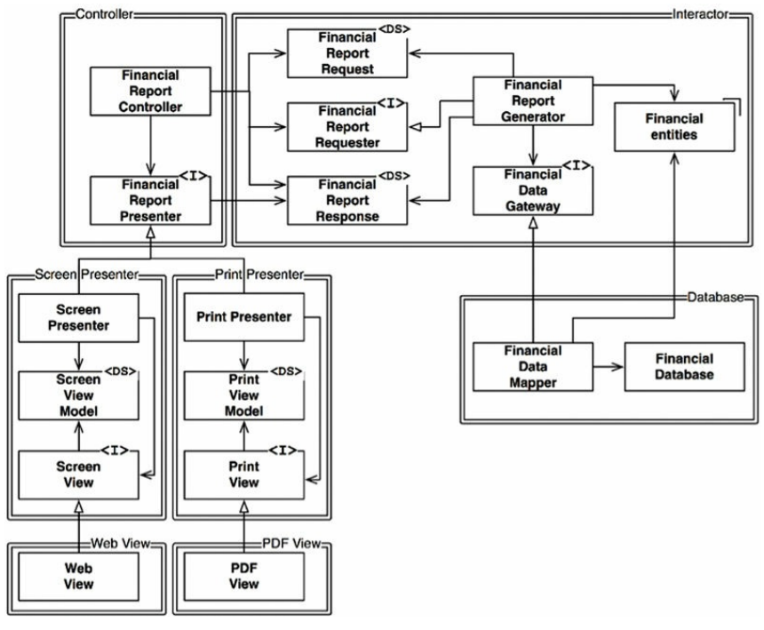
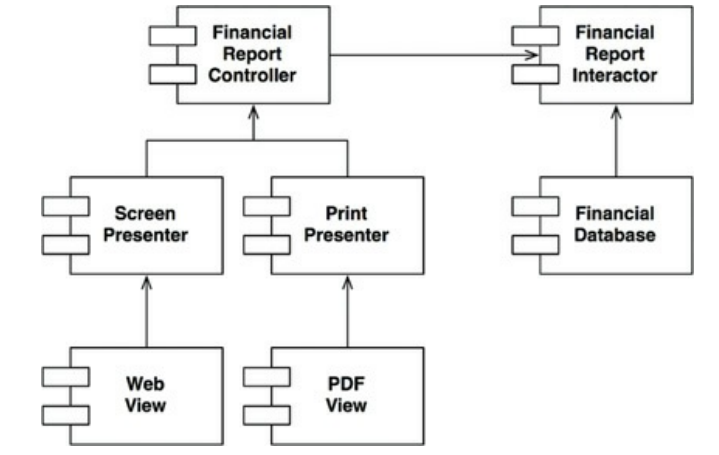

***"A software artifact should be open for extension but closed for modification. Expensible without modifying the artifact."***

Scenario  
A webapp that displays a scrollable report. The new requirement is to add a functionality of printing the report in a particular fromat.
The flow is
````mermaid
graph TD;
A[Financial Data] --> B(Financial Analyzer);
    B --> C[Finanacial Report Data];
    C --> D(Web Reporter);
    C --> E(Print Reporter);

````
Financial Data > Financial Analyzer > Financial Report Data > Web Reporter + Print Reporter
We can implement OCP by creating a heirarchy and utilize interfaces for inversion where needed.





The best possible way to design this is to think of <u><strong>dependencies and herirarchy</strong></u>. Whats our core logic, we keep that at top. Everything else depends on it and it does on no one. Here the core is Interactor. It containes core business logic. As we can use controllers as an extension to handle the display functionality be it in screen or print. And to this Controller Screen Presenter and Print Presenter can be extended, which can later be extended to Views like Web View and PDF view. But the main thing is the core logic depends on database as its inception comes from data. But we can reverse it by using dependency inversion which can be achieved by using inetrface (i.e a contract) between database and interceptor. Now the interceptor and Database functions are decoupled and both need to obey the contract. And now instead of Interactor having dependency on database implementation, we have database implementation depend on Interceptor. <u><strong>directional control</strong></u>
Another benefit if using interfaces is <u><strong>information hiding</strong></u>. The Controller dosent need to know how Interceptor is implemented, the FinancialReportRequester interface acts as an abstraction layer and a contract. 
Now the least area of change is interceptor and Database can be swapped, Controller can be extended for any other kind of presentation eg Excel file downloadable. Print Presented can be extended to either download PDF for trigger Printer Dialog. And even if business logic change in Interceptor happens, there is almost no need of change in extensions if interfaces between all them are obeyed. We can achieve all these new functionalities/updates without having to change anything at any other place or modify the upper heirarchy. We can easily extend any feature.
>Note: While working on a middleware connector projector from scratch, I was benefited with exposure to a complete end to end development and maturity of a software. As out lead changed, we had restructure the project according to his vision. We were guided to implement the system for extensibility, modularity and component swappability. A similar type of class diagram was provided and within some weeks we found the ease of adding new features without creating any mess. We standardized input outputs, separated repsonsibilities of classes, utilized interfaces to make database and aws features swappable, standardized DTOs etc. At that time some things felt unnecessary. After handover of the complete system and getting assigned to a new project, the difference was huge. The new project was a mess and any simple change either needs inclusion of all stakeholders ot results in bugs elsewhere with frequent production bugs. As it was laready headed to migration, for ther year it was to be supported and extended to new business critical requirements which lead to increas of the team size form seven to fifteen. There was no option.
