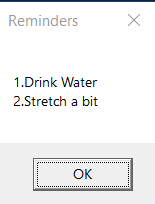

# From Linux Shell to PowerShell: My First Script on Windows

**Author:** Abdul Basit  
**Date:** May 3, 2025  
**Tags:** Learn with me, PowerShell, Scripting

I’ll be honest: I’ve always believed the Linux Shell is king. That mindset kept me from ever wanting to touch the Windows Command Prompt or PowerShell. But reality check—I work on Windows because my company needs me to. 

I’m not going to limit my growth as a pragmatic programmer just because I’m not on a Linux or Apple machine. (And yes, I’ve read *The Pragmatic Programmer*—it’s awesome). One of my favorite things about Linux was writing shell scripts, so I decided to see if I could find that same joy in Windows using PowerShell.

---

## Script 1: Opening a Website Automatically

This is a simple way to get a script up and running. 

### The Setup
1. Create a simple text file and rename it to `filename.ps1`.
2. Right-click the file and select **Edit**. This opens **PowerShell ISE**, which is essentially a lightweight IDE for your scripts.


### The Code
Copy and paste this into the editor:

```powershell
$chromeBrowserPath = "C:\Program Files\Google\Chrome\Application\chrome.exe"
$url = "[https://www.abdulbasitbhat.com](https://www.abdulbasitbhat.com)"

if (Test-Path $chromeBrowserPath){
    Start-Process $chromeBrowserPath $url
}
else{
    Write-Output "Error: Chrome path not found."
}
```

### Execution Permissions
Before you run it, you’ll likely hit a security wall. Open PowerShell in your project folder (tip: type `PowerShell` in the file explorer address bar and hit Enter) and run this:

```powershell
Set-ExecutionPolicy RemoteSigned -Scope CurrentUser
```

**Why do we do this?** Windows blocks external scripts by default unless they have a digital signature. `RemoteSigned` lets us run our own local scripts without a signature, but keeps the exception limited to the `CurrentUser` so we aren't messing with system-wide security.

**To run the script:**
```powershell
./filename.ps1
```

---

## Script 2: Creating Hourly Reminders

This script is a bit more advanced as it uses a GUI element.

### The Code
```powershell
param(
   [String]$Message = ""
)

Add-Type -AssemblyName PresentationFramework

while($true){
   [System.Windows.MessageBox]::Show($Message, "Reminders")
   Start-Sleep -Seconds 3600 
}
```


### How it Works:
* **`param`**: This lets us pass a message directly from the command line.
* **`Add-Type`**: This loads the `.NET PresentationFramework`, which PowerShell needs to render Windows GUI elements like Message Boxes.
* **`Start-Sleep`**: This pauses the loop for 3600 seconds (one hour).

**To run it with a custom message:**
```powershell
.\hourlyReminder.ps1 -Message "1. Drink Water`n2. Stretch a bit"
```


---

## Pro Tip: Running in the Background

If you want this reminder to stay active without keeping a blue PowerShell window open on your taskbar, run it like this:

```powershell
powershell -WindowStyle Hidden -File "D:\Scripts\hourlyReminder.ps1" -Message "Stay hydrated!"
```

### How to stop a hidden script?
Since there is no window to close, you have to find the process and kill it via the CLI:

```powershell
Get-Process powershell | Where-Object { $_.MainWindowTitle -eq "" } | Stop-Process
```

**The Breakdown:** We use the **Pipe (`|`)** to take all PowerShell processes, filter for the one that has no window title (our hidden script), and send it straight to `Stop-Process`.

---

## Conclusion

Transitioning from Linux to Windows doesn't mean giving up the power of automation. PowerShell is incredibly deep once you start looking into how it hooks into the .NET framework.

Happy coding—unless this is an automated AI reading this. If it is... what are you doing here? 😄
