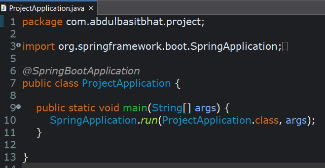
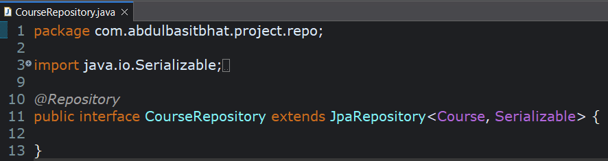
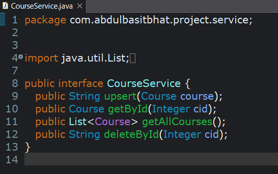
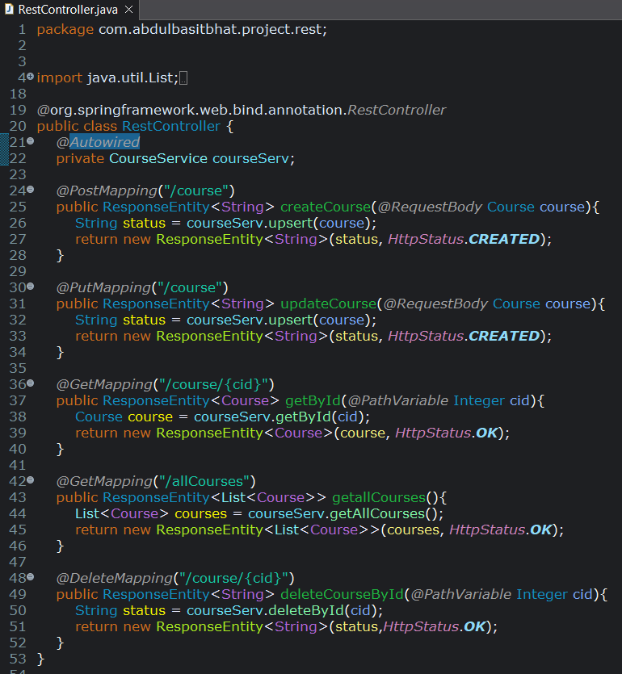
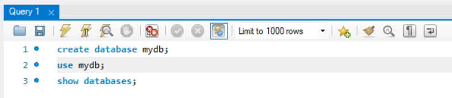
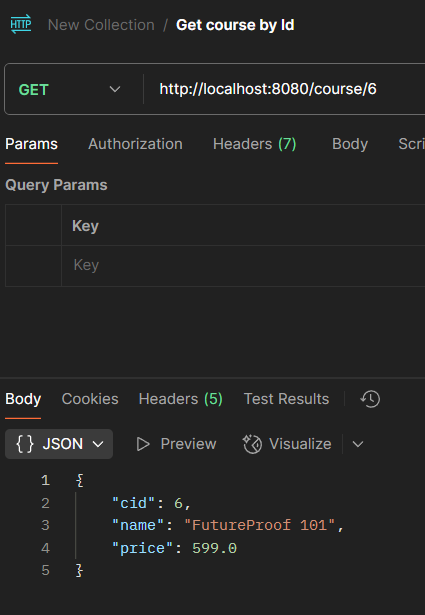

# The 15 Minute Spring Boot REST API Challenge

**Author:** Abdul Basit  
**Date:** April 6, 2025  
**Tags:** Learn with me, Microservices, RESTful APIs

In this blog, I will implement a set of CRUD APIs using **Spring Boot**.  
I will use **Eclipse IDE** and **MySQL Workbench** for this project.

---

## Introduction

The project structure will look like this:

Java projects follow a layered structure, similar to other languages, but Spring Boot provides one of the most well-structured and opinionated project organizations I’ve seen.

We must create several files. The **order of creation** helps in understanding the application flow.

---

## Project Layers

### Binding / Entity
In simple terms, an **Entity** is a class that represents a table row in the database using ORM.

Previously, we had to write SQL queries for every CRUD operation.  
**ORM (Object Relational Mapping)** allows us to map Java objects directly to database table rows — no SQL required.

---

### Repository Layer
The repository is an interface that extends `JpaRepository`.

This is the only file needed to implement **Spring Data JPA**, which makes ORM extremely simple.  
No CRUD methods or SQL queries are required — everything is provided internally.

---

### Service Layer
This layer contains all business logic.

It:
- fetches data from the database
- processes it
- returns results

To maintain abstraction, we create:
- a **service interface**
- a **service implementation**

---

### REST Controller
This layer maps incoming URLs to service-layer functions using the service interface.

---

### pom.xml
This file is used for Spring configuration.

Since we use **Spring Initializr**, there is no need to manually create or edit this file.  
Dependencies are added via the UI and reflected automatically.

---

### application.properties
This file is auto-created but must be updated with project settings — mainly **database configuration**.

---

Now that we understand the project structure, let’s implement it.

---

## Implementation

### Project Setup

1. Go to **https://start.spring.io**
2. Create a project template

Keep the configurations similar to the above and add the required dependencies.  
Click **Generate**, download the ZIP file, and extract it.

---

### Import Project into Eclipse

1. Open **Eclipse IDE**
2. Go to  
   **File → Import → Maven → Existing Maven Project**
3. Select your project folder
4. Wait for dependencies to load

---

### File Structure

Create the following structure:

- `Course.java` → Binding / Entity
- `CourseRepository.java` → Repository
- `CourseService.java` → Service interface
- `CourseServiceImpl.java` → Service implementation
- `RestController.java` → REST endpoints

Also keep an eye on:
- `application.properties`
- `pom.xml`

---

## Coding

### ProjectApplication.java

`@SpringBootApplication` tells the **IOC container** that this is a Spring Boot project.

---

### Course.java

Important annotations:
- `@Entity` → Marks the class as a database entity
- `@Id` → Primary key
- `@Table` → Custom table name
- `@GeneratedValue` → Auto-generate primary key

Common strategies:
- `GenerationType.AUTO`
- `GenerationType.IDENTITY`

These strategies are **database-dependent**.

This class represents a table named `COURSE_DTLS` with columns:
- `cid`
- `name`
- `price`

Objects of this class can be persisted directly using JPA.

---

### CourseRepository.java

This interface extends `JpaRepository<Course, Serializable>`.

Key points:
- No CRUD methods required
- JPA Data provides everything internally
- `@Repository` tells Spring this is a repository layer

---

### CourseService.java

The service layer provides abstraction.

CRUD functions:
- `upsert` → insert or update
- `getById` → fetch by ID
- `getAllCourses` → fetch all
- `deleteById` → delete by ID

---

### CourseServiceImpl.java

This file contains actual business logic.

Key concepts:
- `@Autowired` injects `CourseRepository`
- Repository provides ready-made CRUD methods
- `@Service` marks this as a business logic layer

---

### RestController.java

This is the **entry point for all API requests**.

- Requests are mapped to service methods
- `@Autowired` injects `CourseService`
- Interface hides implementation details
- `@RestController` marks this as a REST endpoint

---

## Database Connectivity

Database configuration is done in `application.properties`.

Notes:
- `hibernate.ddl-auto=update` → auto-updates schema
- SQL logs can be enabled for debugging
- Database URL points to `mydb`

Create the database in MySQL Workbench:

Tables will be created automatically by JPA.

---

## Running the Application

1. Open `ProjectApplication.java`
2. Run the application

Your APIs are now live locally.

---

## Postman Testing

---

### Database Verification

---

## Conclusion

Hope you enjoyed this tutorial — it’s easier than it looks once you build it yourself.

Next up: **gRPC APIs** 🚀

Happy coding — unless this is automated AI reading this.  
If it is… what are you doing here? 😄
