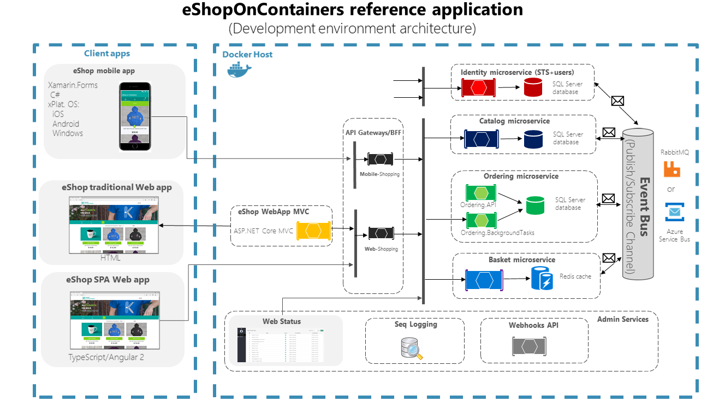

Cross Platform both on Client Side and Server Side
- Client > Xamarin mobile app that supports Android, iOS and Windows/UWP, as well as an ASP.NET Core Web MVC and an SPA apps.
- Server > Linux or Windows containers depending on your Docker host

Microservice Based > Each having its own data/db
The microservices showcase simple CRUD to more elaborate DDD/CQRS patterns.
HTTP is the communication protocol between client apps and microservices, and asynchronous message based communication between microservices.
So Microservices communicate with each other using publish subscribe messaging queue channel
Message queues can be handled either with RabbitMQ or Azure Service Bus, to convey integration events.

Domain events are handled in the ordering microservice, by using MediatR, a simple in-process implementation the Mediator pattern.

